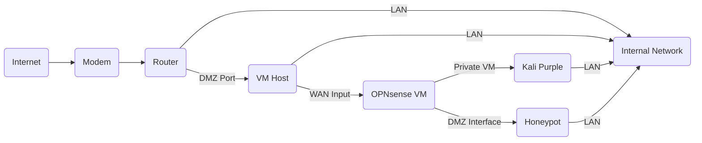

# Copyright (c) [Year] [Your Name]
# MIT License

# SIEM
Kali Purple ELK SIEM with Honeypot

# Kali Purple ELK Honeypot SIEM

This project documents the setup of a SIEM using Kali Purple, the ELK stack (Elasticsearch, Logstash, Kibana), and an attached honeypot for enhanced security monitoring and threat detection.

## Table of Contents

* [Introduction](#introduction)
* [Architecture](#architecture)
* [Components](#components)
* [Installation](#installation)
* [Visualizations](#visualizations)
* [Challenges and Lessons Learned](#challenges-and-lessons-learned)
* [License](#license)

## Introduction

This project aims to demonstrate how to build a cost-effective SIEM using readily available open-source tools within the Kali Purple environment. The integration of a honeypot provides a valuable source of attack data, enhancing our ability to detect and analyze malicious activity.
I followed the guides from https://gitlab.com/kalilinux/kali-purple/documentation for the SIEM and https://github.com/telekom-security/tpotce for the Honeypot. This project was not without some headaches. This was mostly due to me going well beyond the scope of what either of these projects intended.

## Components

I used a dedicated VMWare host (Type I Hypervisor) because that's what I have. Specs as follows:

Server: Dell Precision 7910
Processor: Intel Xeon E5-2603 @ 1.7GHz
Memory: 64GB
Total Storage: 6TB (RAID 10) + 500GB SSD
NICs: 2 onboard gigabit, 1 10Gb Fiber

Again, this is what I am using. It is by no means necessary. It sure did make it easier to spin up a dozen or so test instances and interations of various components in this setup.

## Installation

Part I: Kali Purple

https://www.kali.org/get-kali/


Download the installer. Create a VM using whatever Hypervisor you prefer. I built mine as follows:


You can probably get by with 16GB of memory. Disk space is contingent on how much ingested data you intend to keep. For an average lab setup, 100GB is probably fine.
For the networks, the Kali Purple VM will need to be accessible to the opnsense VM and the LAN so that you can access Kibana without having to deal with the sadness that is interfacing with it through a vmrc or a browser window.

I followed the YouTube guide from I.T Security for the installation and setuo of not only Kali Purple, but for opnsense as well. His video walkthrough is much more detailed than the original instructions. Check it out here:
https://www.youtube.com/playlist?list=PLyJqGMYm0vnOxMapUGkt9DfU4aTTU2vqU

One necessary correction is that on opnsense when you install Filebeat, install Filebeat7, *NOT* Filebeat8. Filebeat8 doesn't work for this configuration. 

Part II: Byzantium
This is the opnsense firewall, which is used to send firewall and suricata logs to Kali Purple's Elasticsearch node. I built the VM as follows:


The purpose of this project was to attach a Honeypot to opnsense. In order for the honeypot to function, it requires unrestricted incoming and outgoing access, which means you will need to add what would otherwise be very unadvised "allow all" rules to the firewall. This begins with adding a Port Forward rule via the NAT function:


This will also auto-create a firewall rule that will send all traffic coming from the opnsense's WAN connection to the DMZ interface where the Honeypot VM is located. It will also create rules on the opnsense DMZ (via the added opt1 interface). In this case, my router's DMZ is sending all incoming WAN traffic to opnsense WAN interface at 172.16.47.6, where it is then redirected to the honeypot via private vlan at 172.18.99.4. I have logging turned on for all of the firewall interfaces and rules, including the Port Forward rule. This will allow opnsense to send the activity to Elasticsearch, where it can be read and visualized by Kibana via the pfSense dashboard. For context, my private vlan between opnsense and Kali Purple is a /30 between 192.168.1.1 and 192.168.1.2.

Part III: Honeypot
For this component, I chose Telekom Security's T-Pot honeynet from https://github.com/telekom-security/tpotce. It is composed of a large number of isolated docker based honeypots. It will expose almost a thousand ports to the internet. It is designed to get noticed. It does that REALLY well.
VM as built:

This VM will consume a LOT of memory because of the ElasticSearch and Kibana components. These run completely separately from Kali Purple, and they run in their own docker containers.
The only real "gotcha" for this build is this: If you want to use a private connection to the DMZ from opnsense *and* a LAN connection for direct web access, you MUST have both interfaces configured before you install the honeypot. Learn from my pain.

Also, the Honeypot will NOT run on Kali Purple. It will run on several distros though. I have a preference for Debian, so I used that. 

If using Debian (and maybe other distros), paste the following into a CLI either with sudo or as root:
```
echo '
vm.max_map_count=262144
net.ipv4.igmp_max_memberships = 50
net.ipv6.conf.all.disable_ipv6 = 1
net.ipv6.conf.default.disable_ipv6 = 1
net.ipv6.conf.lo.disable_ipv6 = 1' > /etc/sysctl.conf
```

and then activate with:
```
sudo sysctl -p
```

This will do a few things:
1. It will increase the maximum memory map areas a program can have. Mostly due to Elasticsearch.
2. The Honeynet creates a LOT of virtual networks. The default max in Debian is supposed to be 20. This increases it to 50. Your install will probably fail if you don't do this.
3. Next 3 lines disable ipv6 because I'm not using it.

Although you can build the distro that your honeypot will live on with a GUI, there isn't much of a reason to do so. The Honeypot includes an NGINX based webserver and if you have your lan access, you can just access it that way.

Installation:
Your distro needs to be bare bones, minimal install. It will be much faster without a GUI. For Debian, just check System Utilities and SSH server. T-Pot will try to remove any conflicting software, but might as well not have extra software installed in the first place.

Oh, special note for those of you running this on a VMWare Type I: If you see a message on VM startup talking about about SMB bus controllers, use this command when you get into the Debian CLI to get rid of the message:

sudo echo 'blacklist i2c-piix4' && sudo tee /etc/modprobe.d/blacklist.conf && sudo update-initramfs -u

This will get rid of the error message.

After the installation of T-Pot, but before the reboot, pay attention to the new SSH port. Port 22 will be a honeypot, so you will be told to use a port the installer specifies. It is recommended that you use publickey auth and NOT PasswordAuthentication for the SSH service. I generally use this sshd_config:
```
HostKey /etc/ssh/ssh_host_ed25519_key

KexAlgorithms curve25519-sha256@libssh.org,diffie-hellman-group-exchange-sha256
Ciphers chacha20-poly1305@openssh.com,aes256-gcm@openssh.com,aes128-gcm@openssh.com
MACs hmac-sha2-512-etm@openssh.com,hmac-sha2-256-etm@openssh.com

AuthenticationMethods publickey
AuthorizedKeysFile %h/.ssh/authorized_keys

PasswordAuthentication no
ChallengeResponseAuthentication no

PermitRootLogin no
AllowUsers ThisIsNotTheUserThatYouAreLookingFor
DenyUsers root

ClientAliveInterval 60
ClientAliveCountMax 3

UseDNS no

X11Forwarding no
PermitTunnel no
AllowAgentForwarding no

Subsystem sftp internal-sftp

LogLevel INFO
```
It is extremely secure and uses ed25519 keys. You can change that to suit your preference.

After the reboot, you can check the status of the honeynet startup with "sudo journalctl -f" and if you don't get a screen full of errors, control C out of the flood and you can use "sudo docker stats" to check on the status of the docker containers. Depending on your VM host, the whole startup process could be about 10 minutes or so. After a few minutes, you can run "sudo dps" to get a more visual status update for the containers:


## Visualizations
When all of the statuses are green, you can open a browser and point it at https://your-honeypot-host-ip:64297. It will ask for the web user and password that you used during the T-Pot setup. After you log in, you will be greeted by:


Select Attack Map and/or Kibana and if your setup is working (DMZ from router pointed to the right place, opnsense forwarding all incoming traffic to T-Pot), it won't take long for you to see:


from the attack map and


from Kibana. Scroll down the Kibana page a bit and soon you will see a populated username and password cloud:


This shows every credential entered into your T-Pot honeynet. 

## Challenges and Lessons Learned
Overall this project was not difficult beyond the lack of good documentation. The I.T Security Youtube video really helped. The guy knows his stuff. That said, I had to start the entire project over several times for various reasons (Also, use Snapshots if you can. Save your sanity.), but this was in large part due to my insatiable need to do things in ways they were absolutely not intended. On the original Kali Purple SOC in a Box, the layout mentions a simple honeypot on a VM called Kali Pearly. I used a different honeypot, but the premise is the same. Also, if you build this project as described, you can see the traffic going into the T-Pot via Kali Purple's Kibana server. It won't have the same pretty dashboards that T-Pot has, or the Attack Map, but it will still show you what is going on. This is because of the Allow All rules from the opnsense firewall. If not for those rules, all of the T-Pot traffic would be stopped anyway, and Purple's Kibana server would just record the occasional port scan. 


